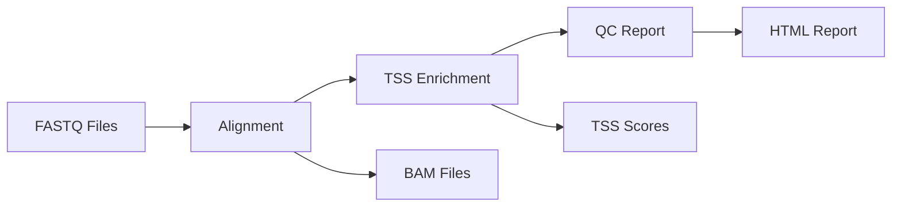

# Problem 3: Aligning ATAC-Seq Data

Create a Nextflow pipeline that aligns ATAC-Seq data using a Rust-based alignment tool, computes TSS enrichment scores, and generates a final report of quality metrics.
# ATAC-Seq Data Processing Pipeline

A comprehensive Nextflow pipeline for processing ATAC-Seq (Assay for Transposase-Accessible Chromatin using sequencing) data with Rust-based analysis tools.

## Features

- **Modular Design**: Each processing step is implemented as a separate, swappable component
- **High Performance**: Rust-based tools for efficient processing of large datasets
- **Comprehensive QC**: Detailed quality control metrics and reports
- **Containerized**: Docker support for reproducible environments
- **Scalable**: Designed for both single samples and large batch processing

## Pipeline Overview



The pipeline consists of three main processes:

1. **align_atac**: Aligns paired-end FASTQ files to reference genome
2. **tss_enrich**: Calculates TSS (Transcription Start Site) enrichment scores
3. **aggregate_qc**: Generates comprehensive quality control reports

## Quick Start

### Prerequisites

- Nextflow (≥22.04.0)
- Docker or Singularity (for containerized execution)
- BWA-MEM2 (for alignment)
- samtools (for BAM processing)
- Python 3 with matplotlib (for plot generation)

### Installation

1. **Clone the repository:**
```bash
git clone https://github.com/your-org/atac-seq-pipeline.git
cd atac-seq-pipeline
```

2. **Build Rust tools:**
```bash
cd rust_tools
cargo build --release
cd ..
```

3. **Set up reference data:**
```bash
# Download reference genome (example for human GRCh38)
wget http://ftp.ensembl.org/pub/release-104/fasta/homo_sapiens/dna/Homo_sapiens.GRCh38.dna.primary_assembly.fa.gz
gunzip Homo_sapiens.GRCh38.dna.primary_assembly.fa.gz

# Index with BWA-MEM2
bwa-mem2 index Homo_sapiens.GRCh38.dna.primary_assembly.fa

# Download TSS annotation
wget http://ftp.ensembl.org/pub/release-104/gtf/homo_sapiens/Homo_sapiens.GRCh38.104.gtf.gz
```

### Running the Pipeline

#### Basic Usage

```bash
nextflow run main.nf \
    --input_dir ./data/fastq \
    --output_dir ./results \
    --reference_genome ./reference/genome.fa \
    --tss_bed ./reference/tss_sites.bed
```

#### Advanced Configuration

```bash
nextflow run main.nf \
    --input_dir ./data/fastq \
    --output_dir ./results \
    --reference_genome ./reference/genome.fa \
    --tss_bed ./reference/tss_sites.bed \
    --aligner_threads 8 \
    --aligner_memory "16G" \
    --tss_window_size 3000 \
    --quality_threshold 20 \
    -profile docker
```

#### Using Containers

```bash
# With Docker
nextflow run main.nf -profile docker [other parameters]

# With Singularity
nextflow run main.nf -profile singularity [other parameters]
```

## Input Data

### FASTQ Files

Place paired-end FASTQ files in the input directory with standard naming:
- `sample1_R1.fastq.gz` and `sample1_R2.fastq.gz`
- `sample2_1.fq.gz` and `sample2_2.fq.gz`
- Any combination of `{R1,R2,1,2}.{fastq,fq}{,.gz}`

### Reference Data

1. **Reference Genome**: BWA-MEM2 indexed FASTA file
2. **TSS Annotation**: BED format file with TSS coordinates

#### Creating TSS BED file from GTF:

```bash
# Extract TSS sites from GTF annotation
awk 'BEGIN{OFS="\t"} $3=="gene" && $7=="+" {print $1, $4-1, $4, $10, 0, $7}' \
    annotation.gtf | sed 's/[";]//g' > tss_plus.bed

awk 'BEGIN{OFS="\t"} $3=="gene" && $7=="-" {print $1, $5-1, $5, $10, 0, $7}' \
    annotation.gtf | sed 's/[";]//g' > tss_minus.bed

cat tss_plus.bed tss_minus.bed | sort -k1,1 -k2,2n > tss_sites.bed
```

## Parameters

### Required Parameters

| Parameter | Description | Example |
|-----------|-------------|---------|
| `--input_dir` | Directory containing FASTQ files | `./data/fastq` |
| `--output_dir` | Output directory for results | `./results` |
| `--reference_genome` | BWA-MEM2 indexed reference genome | `./ref/genome.fa` |
| `--tss_bed` | TSS sites in BED format | `./ref/tss.bed` |

### Optional Parameters

| Parameter | Default | Description |
|-----------|---------|-------------|
| `--rust_tools_dir` | `./rust_tools` | Directory containing Rust executables |
| `--aligner_threads` | `4` | Number of threads for alignment |
| `--aligner_memory` | `"8G"` | Memory limit for alignment |
| `--tss_window_size` | `2000` | Window size around TSS (bp) |
| `--quality_threshold` | `30` | Minimum mapping quality score |
| `--publish_mode` | `"copy"` | Nextflow publish mode |

## Output Structure

```
results/
├── alignments/
│   ├── sample1.sorted.bam
│   ├── sample1.sorted.bam.bai
│   ├── sample1_alignment.log
│   └── sample1_stats.json
├── tss_enrichment/
│   ├── sample1_tss_enrichment.json
│   ├── sample1_tss_profile.bed
│   ├── sample1_tss_plot.png
│   └── sample1_tss.log
└── qc_report/
    ├── atac_seq_qc_report.html
    ├── atac_seq_qc_summary.json
    ├── qc_metrics_table.tsv
    └── aggregate_qc.log
```

### Key Output Files

1. **HTML QC Report** (`atac_seq_qc_report.html`): Interactive quality control dashboard
2. **JSON Summary** (`atac_seq_qc_summary.json`): Machine-readable QC metrics
3. **TSV Table** (`qc_metrics_table.tsv`): Tabular format for further analysis
4. **BAM Files**: Processed, sorted, and indexed alignment files
5. **TSS Plots**: Visualization of TSS enrichment profiles

## Quality Control Metrics

### Alignment Metrics
- **Mapping Rate**: Percentage of reads successfully aligned
- **Quality Rate**: Percentage of high-quality alignments
- **Duplicate Rate**: Percentage of PCR/optical duplicates
- **Final Read Count**: Number of reads after all filtering

### TSS Enrichment Metrics
- **TSS Enrichment Score**: Signal enrichment at TSS vs. background
- **Signal-to-Noise Ratio**: Center region signal vs. flanking regions
- **Quality Grade**: Categorical assessment (Excellent/Good/Acceptable/Poor/Failed)

### Quality Thresholds
- Mapping Rate: ≥70%
- TSS Enrichment: ≥5.0
- Signal-to-Noise: ≥3.0
- Duplicate Rate: ≤30%
- Minimum Reads: ≥10M

## Rust Tools

### atac_aligner
Performs read alignment with quality filtering and deduplication.

```bash
./rust_tools/atac_aligner \
    --reference genome.fa \
    --read1 sample_R1.fastq.gz \
    --read2 sample_R2.fastq.gz \
    --output sample.bam \
    --threads 8 \
    --quality-threshold 30 \
    --remove-duplicates \
    --remove-mitochondrial
```

### tss_calculator
Calculates TSS enrichment scores and generates profiles.

```bash
./rust_tools/tss_calculator \
    --bam sample.bam \
    --tss-bed tss_sites.bed \
    --window-size 2000 \
    --output-json sample_tss.json \
    --output-profile sample_profile.bed \
    --output-plot sample_plot.png
```

### qc_aggregator
Aggregates metrics across samples into comprehensive reports.

```bash
./rust_tools/qc_aggregator \
    --tss-files sample1_tss.json,sample2_tss.json \
    --alignment-stats stats_list.txt \
    --output-html qc_report.html \
    --output-json qc_summary.json \
    --output-table metrics.tsv
```

## Docker Container

### Building the Container

```dockerfile
FROM rust:1.70 as builder

WORKDIR /app
COPY rust_tools/ .
RUN cargo build --release

FROM ubuntu:22.04

RUN apt-get update && apt-get install -y \
    bwa-mem2 \
    samtools \
    python3 \
    python3-matplotlib \
    && rm -rf /var/lib/apt/lists/*

COPY --from=builder /app/target/release/* /usr/local/bin/
```

```bash
docker build -t rust-atac-tools:latest .
```

### Usage with Docker

```bash
nextflow run main.nf -profile docker \
    --input_dir /data/fastq \
    --output_dir /data/results \
    --reference_genome /data/ref/genome.fa \
    --tss_bed /data/ref/tss.bed
```

## Configuration Profiles

### Docker Profile
```nextflow
profiles {
    docker {
        docker.enabled = true
        docker.userEmulation = true
        process.container = 'rust-atac-tools:latest'
    }
}
```

### Cluster Profile
```nextflow
profiles {
    cluster {
        process.executor = 'slur

